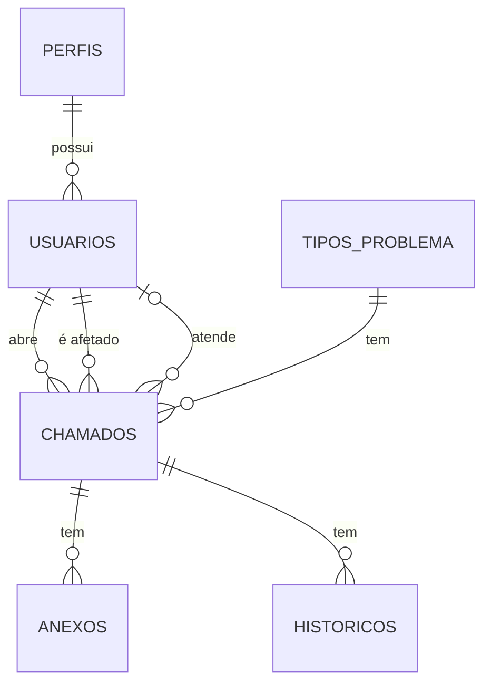

# Modelo de Dados — HelpDesk

## Diagrama Entidade-Relacionamento

## Tabelas

### USUARIOS

| Campo | Descrição |
|---|---|
| `id` | Identificador único do usuário |
| `nome` | Nome do usuário |
| `email` | E-mail utilizado para autenticação |
| `senha` | Hash da senha do usuário |
| `id_perfil` | Referência ao perfil do usuário |
| `status` | Situação do usuário: ativo ou bloqueado |

### PERFIS

| Campo | Descrição |
|---|---|
| `id` | Identificador único do perfil |
| `nome` | Nome do perfil |

### CHAMADOS

| Campo | Descrição |
|---|---|
| `id` | Identificador único do chamado, utilizado como protocolo |
| `id_solicitante` | Referência ao usuário que abriu o chamado |
| `id_usuario_afetado` | Referência ao usuário afetado pelo problema |
| `id_atendente` | Referência ao atendente responsável pelo chamado |
| `id_tipo` | Referência ao tipo de problema |
| `titulo` | Título do chamado, com 5 a 100 caracteres |
| `descricao` | Descrição do problema, com limite de 1.500 caracteres |
| `prioridade` | Prioridade do chamado: Baixa, Média ou Alta |
| `status` | Situação do chamado: Aguardando, Em andamento, Finalizado ou Cancelado |
| `criado_em` | Data e hora de abertura do chamado |
| `fechado_em` | Data e hora de encerramento do chamado |

### TIPOS_PROBLEMA

| Campo | Descrição |
|---|---|
| `id` | Identificador único do tipo de problema |
| `tipo` | Nome do tipo de problema, como Hardware ou Software |
| `status` | Situação do tipo: ativo ou inativo |

### HISTORICOS

| Campo | Descrição |
|---|---|
| `id` | Identificador único do registro de histórico |
| `id_chamado` | Referência ao chamado relacionado |
| `atualizacao` | Descrição da alteração ou atualização realizada |
| `data_e_hora` | Data e hora em que a atualização ocorreu |

### ANEXOS

| Campo | Descrição |
|---|---|
| `id` | Identificador único do anexo |
| `id_chamado` | Referência ao chamado relacionado |
| `caminho_do_anexo` | Caminho ou localização do arquivo armazenado |

## Relacionamentos

- Um **perfil** pode estar associado a vários usuários.
- Cada **usuário** possui um único perfil.
- Um **usuário** pode abrir vários chamados.
- Cada **chamado** possui um único solicitante.
- Um **usuário** pode ser afetado por vários chamados.
- Cada **chamado** possui um único usuário afetado.
- Um **usuário** pode ser responsável por vários chamados.
- Um **chamado** pode ter zero ou um atendente responsável.
- Um **chamado** possui um único tipo de problema.
- Um **tipo de problema** pode estar associado a zero ou muitos chamados.
- Um **histórico** pertence a um único chamado.
- Um **chamado** pode ter zero ou muitos registros de histórico no banco de dados.
- Um **anexo** pertence a um único chamado.
- Um **chamado** pode ter zero ou muitos anexos.

## Regras importantes

- Todo chamado deve possuir um registro de histórico referente à sua criação, inserido automaticamente pela aplicação no momento da abertura.
- A criação do chamado e de seu histórico inicial deve ocorrer na mesma transação, para evitar que um chamado seja registrado sem seu histórico de criação.
- Usuários bloqueados e tipos de problema inativos permanecem registrados no banco de dados.
- Chamados, históricos e anexos devem ser preservados durante o funcionamento normal da aplicação.
